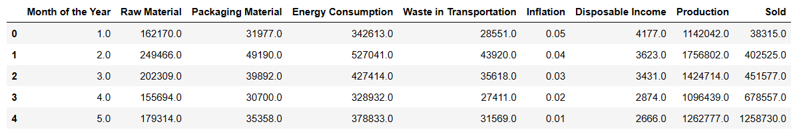

# The Waste Wise 🏆
### 3rd Place — HackWesTX 2023

A machine learning web app that predicts manufacturing sales from economic inputs and generates per-unit resource consumption estimates, helping manufacturers reduce waste across raw materials, packaging, and energy.

---

## Overview

Manufacturing waste is often a consequence of inaccurate demand forecasting. The Waste Wise addresses this by training a Linear Regression model on simulated economic data with seasonal demand patterns, then using predicted sales figures to estimate resource requirements before production begins.

Given three economic inputs — inflation rate, disposable income, and month of year — the app outputs:

- Predicted units sold
- Raw material requirement (kg)
- Packaging material requirement (kg)
- Energy consumption (kWh)
- Transportation waste estimate (bags)

---

## Demo



---

## Tech Stack

| Layer | Tools |
|-------|-------|
| Frontend / UI | Streamlit |
| ML Model | scikit-learn (LinearRegression, StandardScaler) |
| Data Processing | pandas |
| Model Serialization | pickle |
| Data Generation | Python (random, pandas) |

---

## How It Works

**1. Data Generation (`data_generation_and_training.ipynb`)**

Synthetic economic data is generated for every month from 1960 to 2022 (756 rows). Each row includes:
- Production volume (1M–3M units)
- Inflation rate (1%–5%)
- Disposable income ($2,000–$5,000)
- Seasonal demand modifiers (higher sales in May–Aug and December)
- Derived resource consumption values (fixed ratios of production)

**2. Model Training**

A Linear Regression model is trained on three normalized features:
- `Inflation`
- `Disposable Income`
- `Month of the Year`

Target variable: `Sold` (units sold)

Features are normalized using `StandardScaler` before training.

**3. Prediction & Waste Estimation (`demo.py`)**

The trained model predicts sales for user-provided inputs. Resource consumption is estimated using fixed per-unit ratios:

| Resource | Ratio |
|----------|-------|
| Raw Material | 0.142 kg/unit |
| Packaging Material | 0.028 kg/unit |
| Energy Consumption | 0.3 kWh/unit |
| Transportation Waste | 0.025 bags/unit |

---

## Getting Started

### Prerequisites

```bash
pip install streamlit pandas scikit-learn flask flask-cors
```

### Run the App

```bash
streamlit run demo.py
```

The app will open in your browser at `http://localhost:8501`.

### Usage

1. Upload a CSV file with columns: `Inflation`, `Disposable Income`, `Month of the Year`, `Sold`
2. Enter current economic inputs in the sidebar
3. Click **Predict Sales** to see forecasted units and resource estimates

---

## Project Structure

```
The-Waste-Wise/
├── demo.py                                 # Streamlit app + prediction logic
├── data_generation_and_training.ipynb      # Data generation + model training notebook
├── new_file.csv                            # Generated training dataset
├── workfile                                # Serialized trained model (pickle)
├── website1.html                           # Static landing page
├── styles.css                              # Landing page styles
├── script.js                               # Landing page scripts
├── screen.png                              # App screenshot
├── back.jpg                                # Background image
├── icon.png                                # App icon
└── logo-no-background.png
```

---

## Built With

- [Streamlit](https://streamlit.io/) — web app framework
- [scikit-learn](https://scikit-learn.org/) — machine learning
- [pandas](https://pandas.pydata.org/) — data manipulation

---

*This project was built at HackWesTX 2023. The repository was migrated to my personal GitHub in 2025.*
